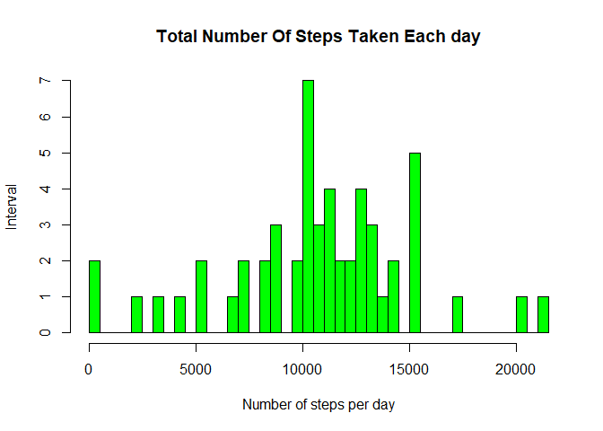

## Loading and preprocessing the data
install.packages("ggplot2")  
install.packages("dplyr")  
install.packages("chron")  
library(ggplot2)  
library(dplyr)   
library(chron)  

```r
data <- read.csv("activity.csv", header = TRUE)
head(data)
```

```
##   steps       date interval
## 1    NA 2012-10-01        0
## 2    NA 2012-10-01        5
## 3    NA 2012-10-01       10
## 4    NA 2012-10-01       15
## 5    NA 2012-10-01       20
## 6    NA 2012-10-01       25
```


## What is mean total number of steps taken per day?

```r
totsteps<- aggregate(steps ~ date, data, FUN=sum)
head(totsteps)
```

```
##         date steps
## 1 2012-10-02   126
## 2 2012-10-03 11352
## 3 2012-10-04 12116
## 4 2012-10-05 13294
## 5 2012-10-06 15420
## 6 2012-10-07 11015
```

```r
## converting dates to Y-M-D format
data$date <- as.Date(data$date, "%Y-%m-%d")

hist(totsteps$steps, 
     col="green", 
     xlab = "Number of steps per day", 
     ylab = "Interval",
     breaks=50,
     main = "Total Number Of Steps Taken Each day")
```

<!-- -->

## 1.Calculate the total number of steps taken per day


```r
datamean <- mean(totsteps$steps)
datamedian <- median(totsteps$steps)
datamean
```

```
## [1] 10766.19
```

```r
datamedian
```

```
## [1] 10765
```
The Mean and Median of the total number of steps taken per day is 1.0766189\times 10^{4} and 10765.

## What is the average daily activity pattern?


```r
totinterval <- aggregate(steps ~ interval, data, FUN=sum)
plot(totinterval$interval, totinterval$steps, 
     type = "l", lwd = 2,
     xlab = "Interval", 
     ylab = "Total Steps",
     main = "Total Steps vs. 5-Minute Interval")
```

<!-- -->


```r
maxsteps <- totinterval$interval[which.max(totinterval$steps)]
maxsteps
```

```
## [1] 835
```

## Imputing missing values

```r
mv= sum(is.na(data$steps))
```
The total number of rows with missing values are 2304  


## 2. Devise a strategy for filling in all of the missing values in the dataset. The strategy does not need to be sophisticated. For example, you could use the mean/median for that day, or the mean for that 5-minute interval, etc.

```r
data$steps[is.na(data$steps)]<-mean(data$steps,na.rm=TRUE)
```
## 3.Create a new dataset that is equal to the original dataset but with the missing data filled in. 

```r
head(data)
```

```
##     steps       date interval
## 1 37.3826 2012-10-01        0
## 2 37.3826 2012-10-01        5
## 3 37.3826 2012-10-01       10
## 4 37.3826 2012-10-01       15
## 5 37.3826 2012-10-01       20
## 6 37.3826 2012-10-01       25
```

##4.Make a histogram of the total number of steps taken each day and Calculate and report the mean and median total number of steps taken per day. Do these values differ from the estimates from the first part of the assignment? What is the impact of imputing missing data on the estimates of the total daily number of steps?

```r
sum_steps<-aggregate(data$steps,by=list(data$date),FUN=sum,na.rm=TRUE) 

hist(sum_steps$x, 
      breaks=seq(from=0, to=25000, by=2500),
      col="yellow", 
      xlab="Total number of steps", 
      ylim=c(0, 30), 
      main="Total number of steps taken each day\n(NA replaced by mean)")
```

<!-- -->
### Mean and median number of steps taken each day after replacing NA values with mean

```r
mean(sum_steps$x)
```

```
## [1] 10766.19
```

```r
median(sum_steps$x)
```

```
## [1] 10766.19
```
## Are there differences in activity patterns between weekdays and weekends?
For this part the weekdays() function may be of some help here. Use the dataset with the filled-in missing values for this part.

```r
# Convert date into weekdays
data$days=tolower(weekdays(data$date))
#Now categorised days into weekend and weekdays
data$day_type <- ifelse(data$days=="saturday"|data$days=="sunday","weekend","weekday")
#Take mean steps taken on weekend or weekday in the intervals

avg_steps <- aggregate(data$steps,by=list(data$interval,data$day_type),FUN=mean,na.rm=TRUE)

colnames(avg_steps) <- c("interval","day_type","steps")
```

## 2.Make a panel plot containing a time series plot (i.e.type = "l") of the 5-minute interval (x-axis) and the average number of steps taken, averaged across all weekday days or weekend days (y-axis).    


```r
library(ggplot2)
ggplot(aes(x=interval,y=steps),data=avg_steps)+geom_line()+facet_wrap(~avg_steps$day_type)
```

<!-- -->


